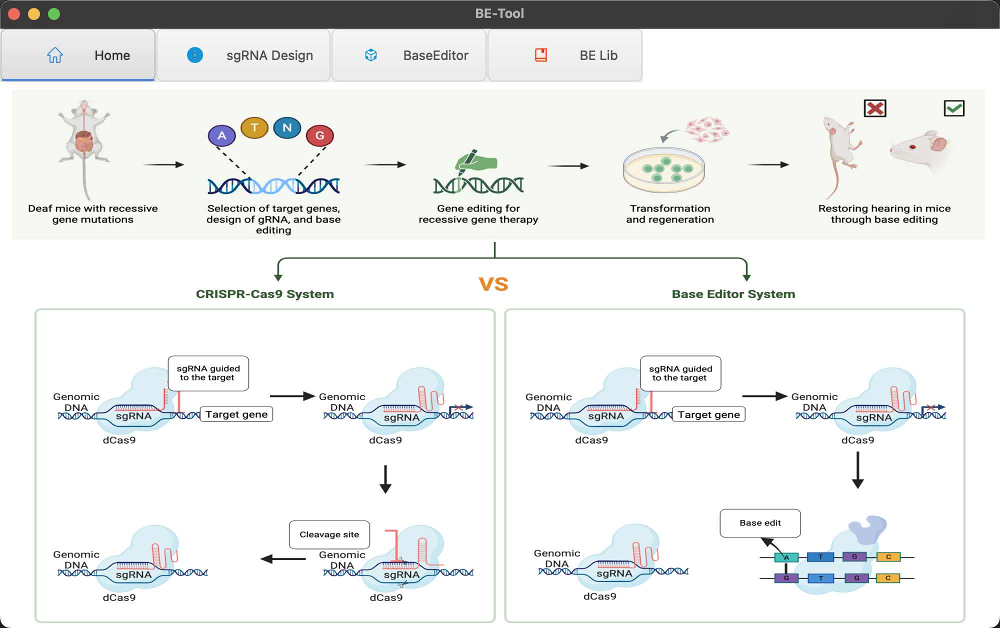
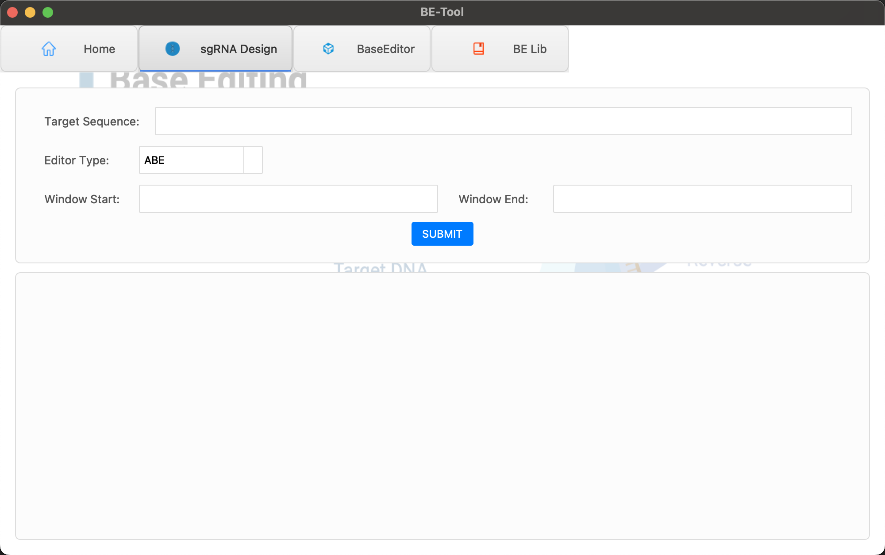
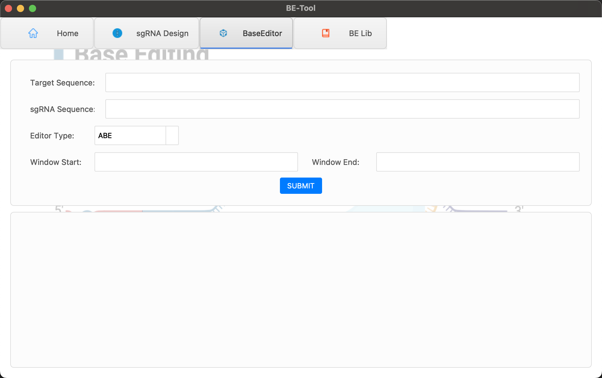
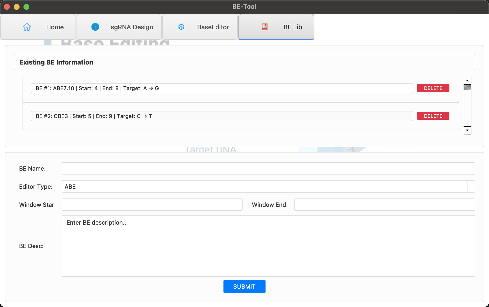

# BE-Tool: Tools for base editor analysis

## introduction

BE-Tool is a comprehensive toolkit for analyzing base editing data, designed specifically for CRISPR base editing experiments. It provides a complete workflow from sgRNA design to editing efficiency calculation.
## functional module

- **Home**：
- **sgRNA Design**：sgRNA assisted design module
- **Base Editor**：Accurately calculate the efficiency of base conversion such as C>T, A>G, etc
- **BE Lib**：BE Knowledge Base Maintenance and Update

### Home

### sgRNA Design

### Base Editor

### BE Lib

## Document

Requirements
Environment
Python: 3.9
Libraries:
numpy: 1.26.3
pandas: 2.2.3
torch: 1.6.3
torchvision (optional for GPU support)
tqdm, pickle, argparse

Please visit the complete document：[https://bioinfo2025.github.io/BE-Tool/](https://bioinfo2025.github.io/BE-Tool/)

  
